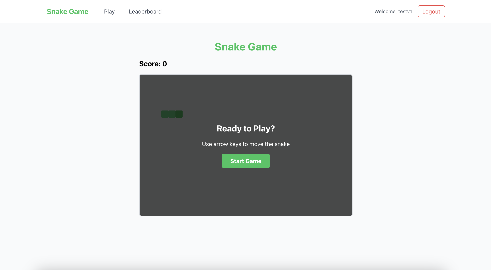
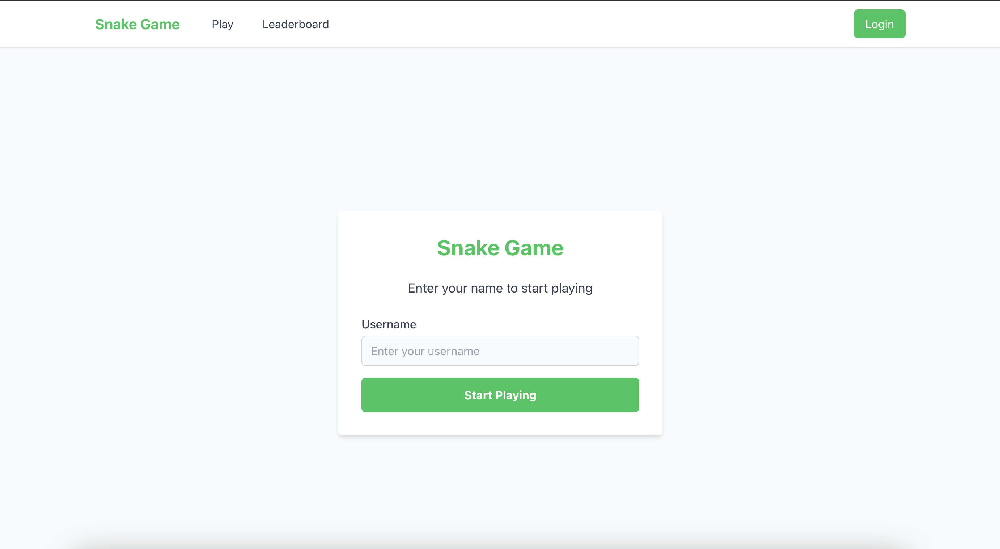
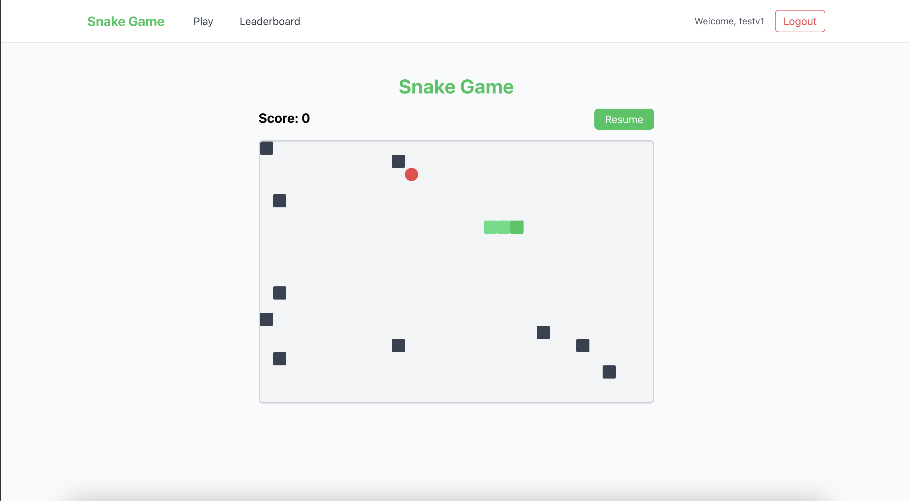
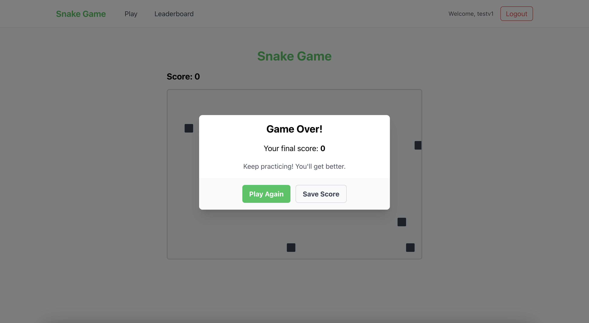
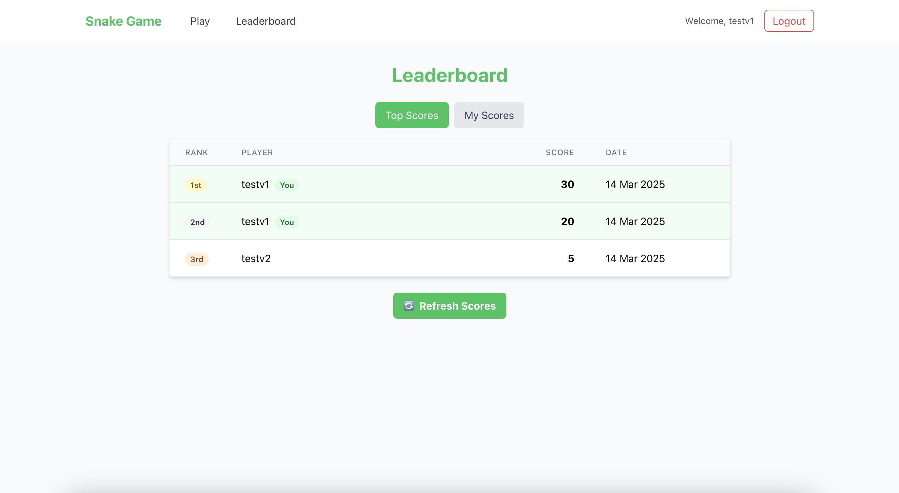

# Snake Game



## Overview

This project is a complete implementation of the classic Snake game with additional features like user authentication, persistent score tracking, and a global leaderboard. The game follows object-oriented programming principles and modern frontend design guidelines.

## Tech Stack

### Frontend
- **React.js** - UI library
- **Tailwind CSS** - Utility-first CSS framework
- **Zustand** - State management
- **React Router** - Client-side routing
- **Axios** - HTTP client

### Backend
- **Node.js** - JavaScript runtime
- **Express.js** - Web framework
- **MongoDB** - NoSQL database
- **Mongoose** - MongoDB ODM
- **JWT** - Authentication

## Architecture & Design Patterns

The application follows a client-server architecture:
- **Frontend**: Single Page Application (SPA) built with React
- **Backend**: RESTful API with Express
- **Database**: MongoDB for persistent data storage

Design patterns used:
- **Zustand** for state management on the frontend
- **Component-based architecture** for UI development
- **Repository pattern** for data access
- **Middleware pattern** for authentication

## Game Features

### Game Mechanics
- Arrow key controls (Up, Down, Left, Right)
- Snake grows when it eats food
- Random placement of food and obstacles
- Collision detection (walls, self, boundaries)
- Game over conditions and restart functionality
- Score tracking based on food eaten

### User Features
- Simple username-based authentication
- Persistent user sessions
- Personal score history
- Global leaderboard with rankings
- Visual feedback for game events

## Installation

### Prerequisites
- Node.js (v14+)
- MongoDB (local or Atlas)
- npm or yarn

### Quick Start

1. Clone the repository:
   ```bash
   git clone <repository-url>
   cd snake-game
   ```

2. Install backend dependencies and start the server:
   ```bash
   cd backend
   npm install
   # Create a .env file with PORT, MONGO_URI, and JWT_SECRET
   npm run dev
   ```

3. Install frontend dependencies and start the development server:
   ```bash
   cd ../frontend
   npm install
   npm start
   ```

For detailed setup instructions, please refer to the README files in the frontend and backend directories.

## Game Instructions

1. **Login**: Enter a username to start
2. **Controls**:
   - Arrow keys to move the snake
   - Spacebar to pause/resume
3. **Objective**:
   - Eat food (red squares) to grow and score points
   - Avoid walls, boundaries, and colliding with yourself
4. **Scoring**:
   - Each food item gives 10 points
   - Your high scores are saved to the leaderboard

## Project Structure

```
snake-game/
├── backend/             # Server code
│   ├── config/          # Database configuration
│   ├── controllers/     # Route controllers
│   ├── middleware/      # Auth middleware
│   ├── models/          # Database models
│   ├── routes/          # API routes
│   └── server.js        # Server entry point
├── frontend/            # Client code
│   ├── public/          # Static assets
│   └── src/             # React components & logic
│       ├── components/  # Reusable components
│       ├── hooks/     # State management
│       ├── pages/       # Page components
│       └── utils/       # Utilities & game logic
├── screenshots/         # Application screenshots
└── README.md            # Main documentation
```

## Screenshots






## Development Process

The project was developed with a feature-based Git workflow:

1. Initial project setup
2. Backend API development
3. Frontend core components
4. Game mechanics implementation
5. User authentication
6. Scoreboard & leaderboard features
7. UI/UX enhancements
8. Testing & bug fixes

## Challenges & Solutions

- **Snake Movement Logic**: Implemented a queue-based approach for smooth and accurate movement
- **Collision Detection**: Created efficient algorithms for detecting various collision types
- **Random Placement**: Developed logic to ensure food and walls appear in valid locations
- **State Management**: Used Zustand for optimized state updates without unnecessary re-renders
- **Game Loop**: Implemented a stable game loop with consistent timing using React's useEffect

## Future Enhancements

- Multiple difficulty levels
- Power-ups and special items
- Multiplayer mode
- Customizable snake appearance
- Mobile touch controls
- Sound effects